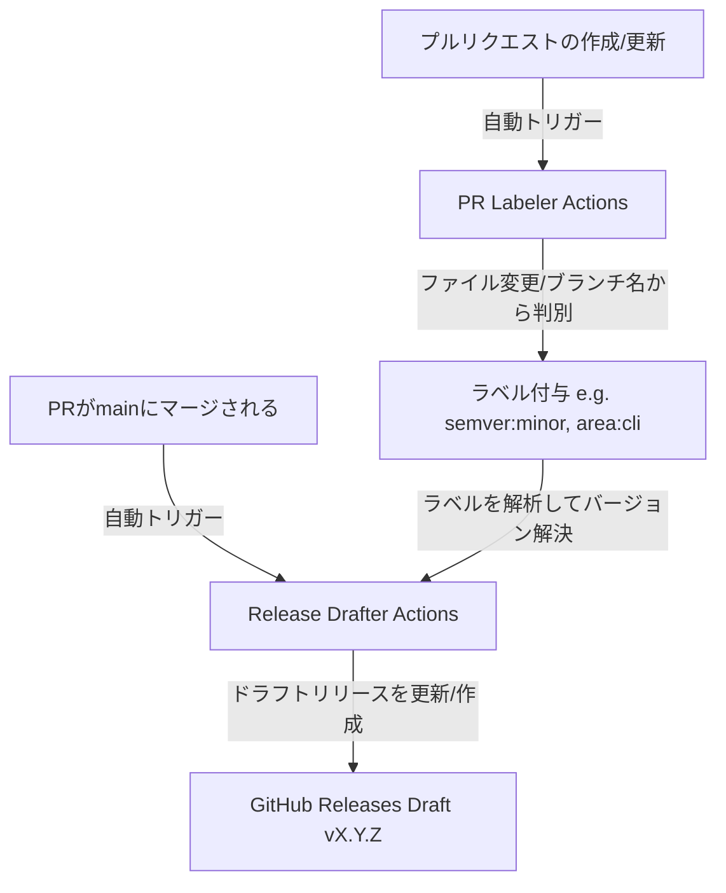

# リリース・ラベリング自動化ワークフロー仕様

本ドキュメントでは、GitHub Actions を使用したプルリクエスト（PR）の自動ラベリングおよびリリースドラフトの自動生成ワークフローについて解説します。

## 構成図



---

## 1. 自動ラベリング (PR Labeler)

プルリクエスト（PR）が作成または更新されると、変更ファイルおよびブランチ名に基づいて、適切なラベルが自動的に追加されます。

### ワークフローファイル
- ワークフロー定義: `.github/workflows/pr-labeler.yml`
- 設定ルール: `.github/labeler-config.yml`

### ラベリングルール

#### A. バージョンアップ種別の自動検出（ブランチ名ベース）
開発者が作成したブランチ名の接頭辞に基づいて、リリースに与える影響（セマンティックバージョニング）を自動検出します。

| ブランチ接頭辞の例 | 付与されるラベル | 意味するリリース種別 |
| :--- | :--- | :--- |
| `breaking/*`, `major/*` | `semver:major` | **メジャーバージョンアップ** (破壊的変更) |
| `feat/*`, `feature/*`, `minor/*` | `semver:minor` | **マイナーバージョンアップ** (新機能の追加) |
| `fix/*`, `bugfix/*`, `hotfix/*`, `patch/*` | `semver:patch` | **パッチバージョンアップ** (バグ修正・軽微な変更) |

#### B. 開発領域の自動検出（変更ファイルのパスベース）
PRで変更されたファイルパスに基づいて、該当するコンポーネントエリアのラベル（`area:*`）を付与します。

| 変更ファイルパスの例 | 付与されるラベル |
| :--- | :--- |
| `lib/veltrunode/dsl/**`, `spec/veltrunode/dsl/**` | `area:dsl` |
| `lib/veltrunode/cli/**`, `exe/**`, `spec/veltrunode/cli/**` | `area:cli` |
| `lib/veltrunode/model/**`, `spec/veltrunode/model/**` | `area:model` |
| `lib/veltrunode/compiler/**`, `spec/veltrunode/compiler/**` | `area:compiler` |
| `lib/veltrunode/deploy/**`, `spec/veltrunode/deploy/**` | `area:deploy` |
| `docs/**`, `*.md` | `area:docs` |
| `.github/**` | `area:ci` |

---

## 2. 自動リリースドラフト生成 (Release Drafter)

`main` ブランチにPRがマージされると、マージされたPRの内容をもとに GitHub 上の「Draft Release（下書きリリース）」が自動作成または更新されます。

### ワークフローファイル
- ワークフロー定義: `.github/workflows/release-draft-generator.yml`
- 設定ルール: `.github/release-drafter-config.yml`

### バージョン決定アルゴリズム (Version Resolver)
前回のタグ（例: `v0.1.0`）から、マージされたPRのラベルを参照して次期バージョンを決定します。

1. **メジャーバージョンアップ**:
   - `semver:major` ラベルが付与されたPRがマージされた場合。
   - 例: `v0.1.0` -> `v1.0.0`
2. **マイナーバージョンアップ**:
   - `semver:minor` または `type:feature` ラベルが付与されたPRがマージされた場合。
   - 例: `v0.1.0` -> `v0.2.0`
3. **パッチバージョンアップ**:
   - `semver:patch` または `type:bugfix` ラベルが付与されたPRがマージされた場合。
   - 例: `v0.1.0` -> `v0.1.1`
4. **デフォルト**:
   - 明示的なラベルがない場合は、安全のため `patch` バージョンアップとして計算されます。

### リリースノート内のカテゴリ自動分類
リリースノート内では、PRのラベルに応じて以下のように変更点が自動的に整理されます。

- **💥 Breaking Changes** (`semver:major` ラベル付きPR)
- **🚀 Features** (`type:feature` または `semver:minor` ラベル付きPR)
- **🐛 Bug Fixes** (`type:bugfix` または `semver:patch` ラベル付きPR)
- **🧰 Maintenance** (`type:chore`, `area:infra`, `area:ci` ラベル付きPR)
- **📖 Documentation** (`type:docs` または `area:docs` ラベル付きPR)
- **🔒 Security** (`area:security` ラベル付きPR)
- **🧪 Testing** (`area:testing` ラベル付きPR)

> **非表示（スキップ）設定**:
> `skip-changelog` ラベルが付与されたPRは、リリースノートの変更履歴一覧に掲載されません。

---

## 3. 開発の流れとベストプラクティス

本ワークフローを最大限に活用するための、日常の開発手順です。

### ステップ 1: 機能開発とブランチ作成
新機能の開発やバグ修正を行う際は、判別用の接頭辞をつけてブランチを作成します。
```bash
# 新機能の場合
git checkout -b feat/my-new-feature

# バグ修正の場合
git checkout -b fix/issue-123
```

### ステップ 2: プルリクエスト (PR) の作成
PRを作成すると、GitHub Actions の **Pull Request Labeler** が起動し、自動的に `semver:minor` と `type:feature` や `area:dsl` などのラベルが付与されます。
> [!NOTE]
> 自動付与されたラベルが意図と異なる場合は、PRの画面から手動でラベルを追加・削除して微調整して問題ありません。

### ステップ 3: レビューとマージ
テストやレビューをパスしたら、PRを `main` ブランチにマージします。

### ステップ 4: ドラフトリリースの確認とリリース実行
1. `main` ブランチへのマージ完了後、**Release Drafter** ワークフローが走り、GitHub の Releases ページに `vX.Y.Z`（下書き状態）が更新または新規作成されます。
2. リリースノートの内容（変更履歴・コントリビューター一覧）および予測されるバージョン番号が正しいことを確認します。
3. リリース準備が整ったら、GitHub Webインターフェース上で **Publish release** ボタンを押すだけで、正式にリリースタグが打たれリリース完了となります。

---

## 4. トラブルシューティング

### ❌ `Configuration file .github/release-drafter-config.yml is not found` エラーが発生する

#### 原因
`release-drafter` は、その設計仕様上、**リポジトリのデフォルトブランチ（通常は `main`）に存在する設定ファイルのみを読み込みます。**
そのため、設定ファイル（`.github/release-drafter-config.yml`）を初めて追加した機能ブランチ（またはそのブランチからのPR）の段階では、デフォルトブランチにファイルが存在しないため、このエラーが発生します。

#### 対策
このエラーは、**設定ファイルを含むブランチ（現在の `release-drafter` ブランチ）を一度 `main` ブランチにマージすることで解消されます。**
マージが完了した以降のすべてのPRおよびプッシュでは、正常に設定ファイルが読み込まれ、リリースノートの自動更新が動作するようになります。

### ⚠️ `Warning: "pull_request_target.opened" is not a known webhook name` 警告が表示される

#### 原因
Release Drafter の内部で使用されているフレームワーク（Probot/Octokit）が、GitHub Actions 独自のイベントである `pull_request_target` のアクティビティタイプ（`opened`, `synchronize` 等）を古いWebhook APIスキーマと照合して出力する**無害な警告（Warning）**です。

#### 対策
ワークフローの実行や自動処理そのものには影響を与えません。無視していただいて問題ありません。

